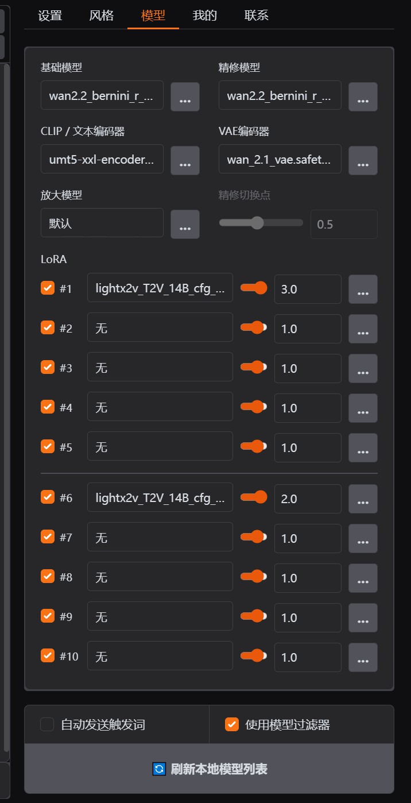
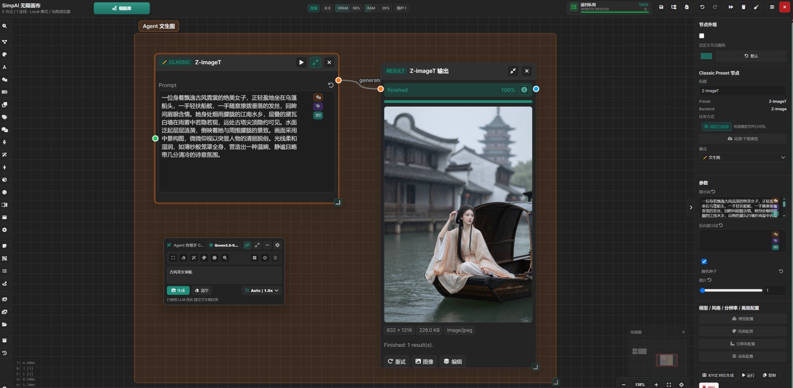
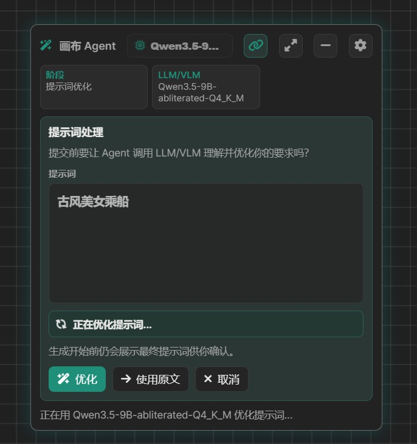
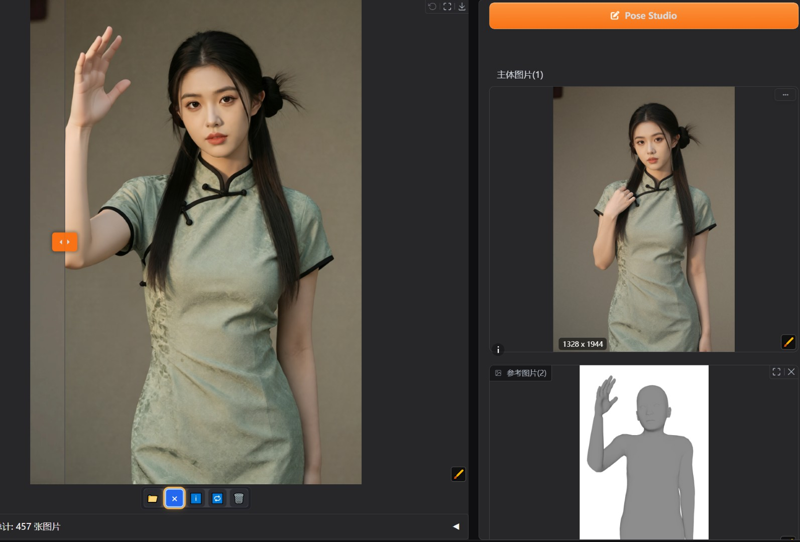

# SimpAI Studio Showcase

这里集中放置 README 使用的项目截图，方便后续替换和扩展。The images below are the README showcase assets for quick review and future updates.

## Main WebUI / 主 WebUI

| Screenshot / 截图 | Description / 说明 |
| --- | --- |
|  | 主 WebUI 总览：预置包、提示词、参数、图库和 VLM/LLM 助手。 Main WebUI overview with presets, prompt editing, parameters, gallery and VLM/LLM assistant. |
|  | Preset Store：分类、搜索、卡片和状态信息。 Preset Store with categories, search, cards and status hints. |
|  | 预置包详情：功能介绍、模型依赖和场景入口。 Preset detail page with feature notes, model dependencies and scenario entry points. |
|  | 模型浏览器：LoRA/模型筛选、预览、选择和元数据。 Model Browser with LoRA/model filters, previews, selection and metadata. |
|  | 模型信息页：模型说明、预览和关联操作。 Model page with details, previews and related actions. |
|  | 生成结果图库：历史结果、媒体查看和继续编辑入口。 Generation gallery with history, media browsing and follow-up editing actions. |

## Infinite Canvas / 无限画布

| Screenshot / 截图 | Description / 说明 |
| --- | --- |
|  | 无限画布总览：预置包节点、素材、结果节点和运行状态。 Infinite Canvas overview with preset nodes, assets, result nodes and run status. |
|  | 模板库：图片、视频、音频、Timeline 和结果复用模板。 Template library for image, video, audio, timeline and result reuse workflows. |
|  | Canvas Agent 与 VLM Chat：辅助提示词、素材理解和画布编排。 Canvas Agent and VLM Chat for prompt help, asset understanding and canvas planning. |
|  | 画布助手在节点和运行上下文中处理任务信息。 Canvas Agent handles task information from node and run context. |
|  | 画布助手面板：模型、模式和提示词相关设置。 Canvas Agent panel with model, mode and prompt-related settings. |

## Image Input & Editing / 图像输入与编辑

| Screenshot / 截图 | Description / 说明 |
| --- | --- |
|  | 图像提示与 ControlNet：管理参考图和控制输入。 Image Prompt and ControlNet for managing references and control inputs. |
|  | Inpaint / Outpaint：局部重绘、扩图、遮罩和场景编辑。 Inpaint / Outpaint for local repainting, expansion, masks and scene editing. |
|  | Enhance+：局部增强和图片修复相关工具。 Enhance+ tools for local enhancement and image repair tasks. |
|  | Upscale / Variation：放大、变化和继续生成。 Upscale / Variation for enlargement, variation and continued generation. |

## Specialized Modules / 特色模块

| Screenshot / 截图 | Description / 说明 |
| --- | --- |
|  | Pose Studio：角色姿态编辑并发送到场景预置包。 Pose Studio for editing character poses and sending them to scene presets. |
|  | 姿态编辑结果：从编辑姿态到生成结果的效果展示。 Pose result preview from pose editing to generated output. |
|  | Gaussian Studio：3D/多视角素材的可视化视角编辑。 Gaussian Studio for visual camera editing on 3D and multi-view assets. |
|  | Qwen TTS：语音合成、角色音色和对白类工作流。 Qwen TTS for speech synthesis, character voices and dialogue workflows. |

## Backends / 后端与独立界面

| Screenshot / 截图 | Description / 说明 |
| --- | --- |
|  | ComfyUI：节点工作流执行基础，与主 WebUI 共享资源。 ComfyUI provides the node workflow runtime and shares assets with the main WebUI. |
|  | Forge Neo：Gradio 6 风格独立界面，兼容 WebUI/Forge 使用习惯。 Forge Neo provides a Gradio 6 standalone interface compatible with WebUI/Forge workflows. |
