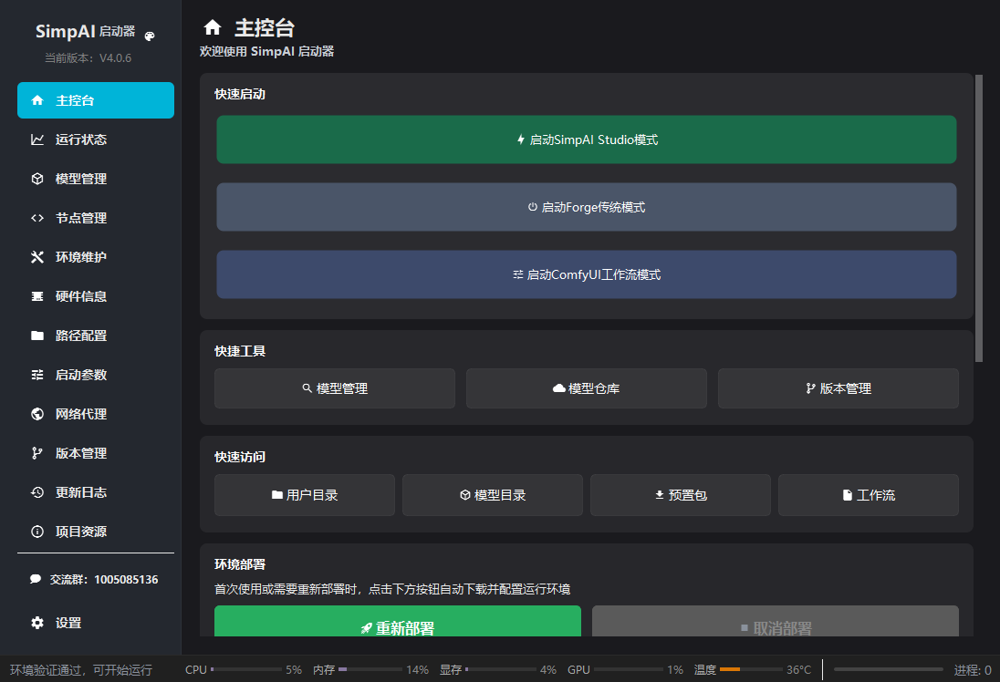
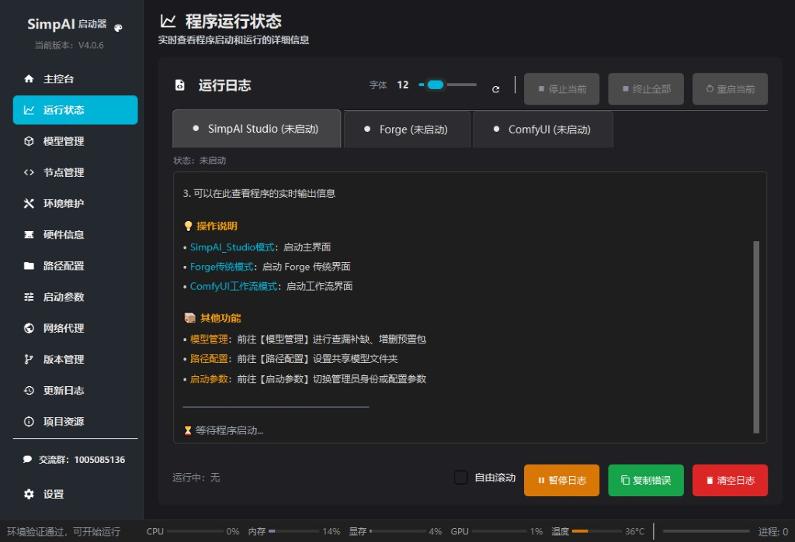
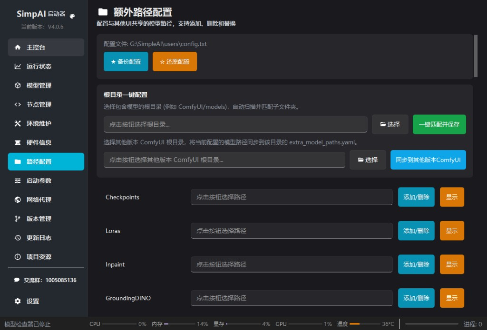
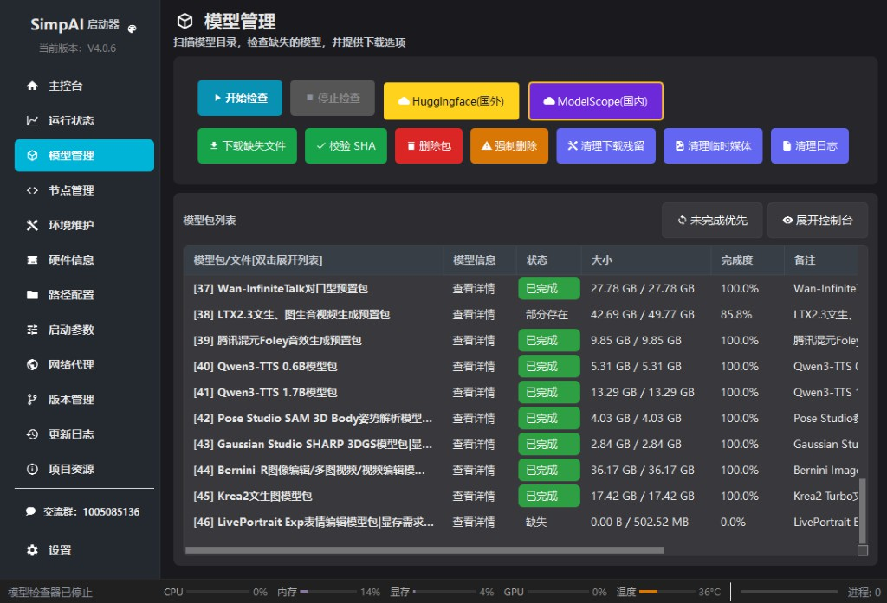

# Windows 版本启动器

Windows 版本启动器用于部署和管理 SimpAI Studio 的 Windows 一键整合包。普通 Windows 用户可以先通过启动器完成部署，再从启动器选择主 WebUI、ComfyUI 或 Forge Neo。

## 界面截图



| 运行状态 | 路径设置 | 模型管理 |
| --- | --- | --- |
|  |  |  |

## 下载入口

- 启动器网盘入口：[Windows 版本启动器](https://pan.quark.cn/s/767d38736010)
- Studio 运行包：[SimpAI_Studio_win.zip](https://www.modelscope.cn/models/windecay/SimpAI_dev/resolve/master/SimpAI_Studio_win.zip)

`SimpAI_Studio_win.zip` 是启动器部署时使用的 Studio 运行包，包含 Windows embedded Python、Studio 代码和外层 bat 入口。

## 推荐目录

建议解压或部署到空间充足、路径较短的纯英文、无特殊字符目录，例如 `D:\SimpleAI\`。常见启动入口类似：

```text
G:\SimpleAI\SimpAI_Studio_win\run_SimpAI_常规启动.bat
```

推荐结构：

```text
SimpleAI/
├─ SimpAI_Studio_win/
│  ├─ python_embeded/
│  ├─ SimpAI_Studio/
│  ├─ run_SimpAI_常规启动.bat
│  ├─ run_ComfyUI_工作流模式.bat
│  ├─ run_ForgeNeo_传统界面.bat
│  ├─ model_checker_模型检测.bat
│  └─ update_SimpAI_更新程序.bat
├─ SimpleModels/
└─ users/
```

- `SimpAI_Studio_win/`：Windows 发布包目录，外层 bat 放在这里。
- `SimpAI_Studio_win/SimpAI_Studio/`：Studio 代码目录。
- `SimpAI_Studio_win/python_embeded/`：Windows 打包版自带 Python。
- `SimpleModels/`：共享模型目录，主 WebUI、ComfyUI 和 Forge Neo 共用。
- `users/`：用户配置、输出、工作区、Forge Neo 状态和 ComfyUI 独立输出目录。

这个结构下，更新或者重置 `SimpAI_Studio/` 时不需要移动已有模型和生成记录。也可以并行建立多个文件夹如`SimpAI_Studio_win_1/`、`SimpAI_Studio_win_2/`，进行多版本共存，自动共用上层模型目录和用户存储目录。
但如果你在ComfyUI模式中存储了自己的工作流，则需要手动迁移。

## 启动方式

优先使用启动器管理环境、更新和入口。没有启动器时，也可以运行外层 bat：

| bat | 用途 |
| --- | --- |
| `run_SimpAI_常规启动.bat` | 启动主 WebUI。 |
| `run_ComfyUI_工作流模式.bat` | 启动内置 ComfyUI 节点界面。 |
| `run_ForgeNeo_传统界面.bat` | 启动 Forge Neo 传统 WebUI。 |
| `model_checker_模型检测.bat` | 打开预置包模型检测和下载工具。 |
| `update_SimpAI_更新程序.bat` | 打开更新工具。 |

## 当前打包限制

- 目前一键整合包只提供 Windows + NVIDIA CUDA 13（显卡驱动版本580及以上）。
- 打包版默认面向 RTX 20 系及以上 NVIDIA 显卡。更老的 NVIDIA 显卡未做测试和适配。
- Linux 目前提供源码启动和自建环境说明，但没有提供单独的一键整合包。
- AMD、Intel 显卡尚未提供一键整合包，也尚未完成直接适配和打包验证。相关用户需要自行配置 PyTorch / ROCm / DirectML / IPEX 等环境，并按实际节点兼容情况处理。
- 当前打包环境使用 Python `3.13`、PyTorch `2.9.1+cu130` 和 CUDA 13 路线。自建环境使用其他版本时，ONNX Runtime、bitsandbytes、视频节点和 3D 高斯节点可能需要额外调整。
